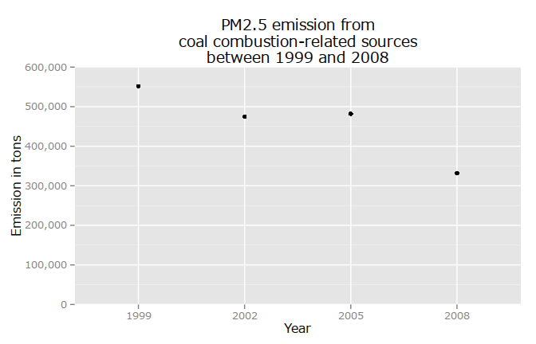

# Exploratory data analysis - Course Project 2
Balint SZEBENYI  
2015-05-22  

#Introduction

This document collects all the plots relevant to answer the questions of the course project of the Coursera course: Exploratory Data Analysis.

The dataset contains emission information about fine particulate matter. This collected data is used to analyze potential harmful effects based on measurements from 1999, 2002, 2005, 2008.

*Please note, I have decided to include every knitr output to make it easier to see what is going on in the background.*

#R Setup
Libraries

```r
library(knitr) #markdown
library(lattice) #plotting
library(data.table) #big tables
library(stringr) #string_match
library(ggplot2) #ggplot2
library(scales) #ggplot2 scientific notation disabling
library(xtable) #table output
```
Setup working directory and figures location

```r
working_dir <- "/home/szebenyib/explo/project_02/"
opts_chunk$set(fig.path="figure/")
```
Localization of units

```r
Sys.setlocale("LC_TIME", "C")
```

```
## [1] "C"
```


#Loading and preprocessing the data
The necessary zip file will be downloaded, unzipped and loaded into variables.

```r
filename <- "NEI_data.zip"
full_path <- paste(working_dir,
                   filename,
                   sep = "")
if (!file.exists(full_path)) {
  download.file(url = "https://d396qusza40orc.cloudfront.net/exdata%2Fdata%2FNEI_data.zip",
                destfile = full_path, 
                method = "curl")
  unzip(zipfile = full_path,
        exdir = working_dir)
}
nei <- readRDS(file = paste(working_dir,
                            "summarySCC_PM25.rds",
                            sep = ""))
scc <- readRDS(file = paste(working_dir,
                            "Source_Classification_Code.rds",
                            sep = ""))
```

A brief overview of the data frames:

```r
str(nei)
```

```
## 'data.frame':	6497651 obs. of  6 variables:
##  $ fips     : chr  "09001" "09001" "09001" "09001" ...
##  $ SCC      : chr  "10100401" "10100404" "10100501" "10200401" ...
##  $ Pollutant: chr  "PM25-PRI" "PM25-PRI" "PM25-PRI" "PM25-PRI" ...
##  $ Emissions: num  15.714 234.178 0.128 2.036 0.388 ...
##  $ type     : chr  "POINT" "POINT" "POINT" "POINT" ...
##  $ year     : int  1999 1999 1999 1999 1999 1999 1999 1999 1999 1999 ...
```

```r
table <- xtable(head(nei))
print(table,
      type = "html")
```

<!-- html table generated in R 3.1.3 by xtable 1.7-4 package -->
<!-- Sun May 24 11:58:05 2015 -->
<table border=1>
<tr> <th>  </th> <th> fips </th> <th> SCC </th> <th> Pollutant </th> <th> Emissions </th> <th> type </th> <th> year </th>  </tr>
  <tr> <td align="right"> 4 </td> <td> 09001 </td> <td> 10100401 </td> <td> PM25-PRI </td> <td align="right"> 15.71 </td> <td> POINT </td> <td align="right"> 1999 </td> </tr>
  <tr> <td align="right"> 8 </td> <td> 09001 </td> <td> 10100404 </td> <td> PM25-PRI </td> <td align="right"> 234.18 </td> <td> POINT </td> <td align="right"> 1999 </td> </tr>
  <tr> <td align="right"> 12 </td> <td> 09001 </td> <td> 10100501 </td> <td> PM25-PRI </td> <td align="right"> 0.13 </td> <td> POINT </td> <td align="right"> 1999 </td> </tr>
  <tr> <td align="right"> 16 </td> <td> 09001 </td> <td> 10200401 </td> <td> PM25-PRI </td> <td align="right"> 2.04 </td> <td> POINT </td> <td align="right"> 1999 </td> </tr>
  <tr> <td align="right"> 20 </td> <td> 09001 </td> <td> 10200504 </td> <td> PM25-PRI </td> <td align="right"> 0.39 </td> <td> POINT </td> <td align="right"> 1999 </td> </tr>
  <tr> <td align="right"> 24 </td> <td> 09001 </td> <td> 10200602 </td> <td> PM25-PRI </td> <td align="right"> 1.49 </td> <td> POINT </td> <td align="right"> 1999 </td> </tr>
   </table>

```r
str(scc)
```

```
## 'data.frame':	11717 obs. of  15 variables:
##  $ SCC                : Factor w/ 11717 levels "10100101","10100102",..: 1 2 3 4 5 6 7 8 9 10 ...
##  $ Data.Category      : Factor w/ 6 levels "Biogenic","Event",..: 6 6 6 6 6 6 6 6 6 6 ...
##  $ Short.Name         : Factor w/ 11238 levels "","2,4-D Salts and Esters Prod /Process Vents, 2,4-D Recovery: Filtration",..: 3283 3284 3293 3291 3290 3294 3295 3296 3292 3289 ...
##  $ EI.Sector          : Factor w/ 59 levels "Agriculture - Crops & Livestock Dust",..: 18 18 18 18 18 18 18 18 18 18 ...
##  $ Option.Group       : Factor w/ 25 levels "","C/I Kerosene",..: 1 1 1 1 1 1 1 1 1 1 ...
##  $ Option.Set         : Factor w/ 18 levels "","A","B","B1A",..: 1 1 1 1 1 1 1 1 1 1 ...
##  $ SCC.Level.One      : Factor w/ 17 levels "Brick Kilns",..: 3 3 3 3 3 3 3 3 3 3 ...
##  $ SCC.Level.Two      : Factor w/ 146 levels "","Agricultural Chemicals Production",..: 32 32 32 32 32 32 32 32 32 32 ...
##  $ SCC.Level.Three    : Factor w/ 1061 levels "","100% Biosolids (e.g., sewage sludge, manure, mixtures of these matls)",..: 88 88 156 156 156 156 156 156 156 156 ...
##  $ SCC.Level.Four     : Factor w/ 6084 levels "","(NH4)2 SO4 Acid Bath System and Evaporator",..: 4455 5583 4466 4458 1341 5246 5584 5983 4461 776 ...
##  $ Map.To             : num  NA NA NA NA NA NA NA NA NA NA ...
##  $ Last.Inventory.Year: int  NA NA NA NA NA NA NA NA NA NA ...
##  $ Created_Date       : Factor w/ 57 levels "","1/27/2000 0:00:00",..: 1 1 1 1 1 1 1 1 1 1 ...
##  $ Revised_Date       : Factor w/ 44 levels "","1/27/2000 0:00:00",..: 1 1 1 1 1 1 1 1 1 1 ...
##  $ Usage.Notes        : Factor w/ 21 levels ""," ","includes bleaching towers, washer hoods, filtrate tanks, vacuum pump exhausts",..: 1 1 1 1 1 1 1 1 1 1 ...
```

#Questions

##Have total emissions from PM2.5 decreased in the United States from 1999 to 2008?
**Using the base plotting system, make a plot showing the total PM2.5 emission from all sources for each of the years 1999, 2002, 2005, and 2008.**


```r
total_emission_by_year <- tapply(X = nei$Emissions,
                                 INDEX = nei$year,
                                 FUN = sum)
plot(x = names(total_emission_by_year),
     y = total_emission_by_year,
     ylim = c(0, 8e6),
#      type = "l",
     xlab = "Years",
     ylab = "PM2.5 in million tons",
     yaxt = "n",
     xaxt = "n",
     main = "Total emission of PM2.5 in the U.S. between 1999 and 2008")
at_x <- names(total_emission_by_year)
axis(1,
     at = at_x,
     labels = at_x,
#      vadj = 1,
     cex.axis = 0.8)
at_y <- seq(from = 0,
              to = 7e6,
              by = 1e6)
axis(2,
     at = at_y,
     labels = format(at_y / 1000000,
                     scientific = FALSE),
     hadj = 0.9,
     cex.axis = 0.8)
grid()
```

 

```r
remove(total_emission_by_year)
```
As it can be deduced from the graph a negative trend is to be observed in the total amount of PM2.5. Therefore it can be concluded that the amount of PM2.5 has decreased in the U.S. in the observation period. However this conclusion is based only on four data points in this interval therefore it should be treated with caution.

##Have total emissions from PM2.5 decreased in the Baltimore City, Maryland (fips == "24510") from 1999 to 2008?
**Use the base plotting system to make a plot answering this question.**

```r
total_emission_by_city_and_year <- tapply(X = nei$Emissions,
                                          INDEX = interaction(nei$fips,
                                                              nei$year),
                                          FUN = sum)
row_ids_of_baltimore <- grep("^24510",
                             names(total_emission_by_city_and_year))
total_emission_baltimore_per_year <- total_emission_by_city_and_year[row_ids_of_baltimore]
#keep only the years from eg.: 24510.1999 --> 1999
names(total_emission_baltimore_per_year) <- substr(names(total_emission_baltimore_per_year),
                                                   7,
                                                   10)
plot(x = names(total_emission_baltimore_per_year),
     y = total_emission_baltimore_per_year,
     ylim = c(0, 4000),
#      type = "l",
     xlab = "Years",
     ylab = "PM2.5 in tons",
     yaxt = "n",
     xaxt = "n",
     main = "Total emission of PM2.5 in Baltimore City, Maryland\nbetween 1999 and 2008")
at_x <- names(total_emission_baltimore_per_year)
axis(1,
     at = at_x,
     labels = at_x,
#      vadj = 1,
     cex.axis = 0.8)
at_y <- seq(from = 0,
              to = 4000,
              by = 500)
axis(2,
     at = at_y,
     labels = format(at_y,
                     scientific = FALSE),
     hadj = 0.5,
     cex.axis = 0.8)
grid()
```

 

```r
remove(total_emission_by_city_and_year,
       row_ids_of_baltimore,
       total_emission_baltimore_per_year)
```

The total PM2.5 emission in Baltimore City, Maryland cannot be confirmed to have seen a decrease. There are four accumulated observations for more approximately ten years and there is no clear tendency. The observations tend to jitter around 3000 tons with a slight negative tendency, but four data points are not enough to call this a tendency.

##Of the four types of sources indicated by the type (point, nonpoint, onroad, nonroad) variable, which of these four sources have seen decreases in emissions from 1999–2008 for Baltimore City?
**Which have seen increases in emissions from 1999–2008? Use the ggplot2 plotting system to make a plot to answer this question.**

I could have used strsplit, but I have found regex first, so I have decided to leave it here for the sake of variety.


```r
total_emission_by_city_year_type <- tapply(X = nei$Emissions,
                                          INDEX = interaction(nei$fips,
                                                              nei$year,
                                                              nei$type),
                                          FUN = sum)
row_ids_of_baltimore <- grep("^24510",
                             names(total_emission_by_city_year_type))
total_emission_baltimore_per_year_type <- total_emission_by_city_year_type[row_ids_of_baltimore]
df <- as.data.frame(total_emission_baltimore_per_year_type)
names(df)[1] <- "emission"
df$year <- substr(str_match(names(total_emission_baltimore_per_year_type),
                            "\\.([0-9]){4}\\."), 
                  2,
                  5)[ , 1]
names_list_of_rows <-strsplit(names(total_emission_baltimore_per_year_type),
                              "\\.")
col_data <- t(as.data.frame(names_list_of_rows))
df$type <- col_data[ , 3]
names(total_emission_baltimore_per_year_type) <- substr(names(total_emission_baltimore_per_year_type),
                                                   7,
                                                   10)
g <- ggplot(df, aes(year, emission))
p <- (g
      + geom_point(aes(color = type))
      + ggtitle("PM2.5 emission in Baltimore\nbetween 1999 and 2008")
      + labs(x = "Year", y = "Emission in tons"))
print(p)
```

 

```r
# remove(total_emission_by_city_year_type,
#        row_ids_of_baltimore,
#        total_emission_baltimore_per_year_type,
#        df,
#        names_list_of_rows,
#        col_data)
```

It can be declared that the non-road, the on-road and the nonpoint sources have seen a decrease in emissions. The point sources have however shown a spike in 2005 which needs further investigation.

##Across the United States, how have emissions from coal combustion-related sources changed from 1999–2008?

I have decided to use the first and the fourth scc levels to identify combustion and coal related sources respectively. Then I have used the union of these two identifiers to find the observations that are related to coal combustion.


```r
combustion_ids <- grepl("*[C|c]ombustion*",
                        scc$SCC.Level.One)
coal_ids <- grepl("*[C|c]oal*",
                  scc$SCC.Level.Four)
coal_combustion_ids <- combustion_ids & coal_ids
combustion_sccs <- scc$SCC[coal_combustion_ids]
coal_combustion_df <- nei[nei$SCC %in% as.character(combustion_sccs), ]
coal_combustion_per_year <- tapply(X = coal_combustion_df$Emissions,
                                   INDEX = coal_combustion_df$year,
                                   FUN = sum)
g <- ggplot(as.data.frame(coal_combustion_per_year),
            aes(names(coal_combustion_per_year),
                coal_combustion_per_year))
p <- (g
      + geom_point()
      + coord_cartesian(ylim = c(0, 600000))
      + scale_y_continuous(labels = comma)
      + ggtitle("PM2.5 emission from\ncoal combustion-related sources\nbetween 1999 and 2008")
      + labs(x = "Year", y = "Emission in tons"))
print(p)
```

 

```r
remove(combustion_ids,
       coal_ids,
       coal_combustion_ids,
       combustion_sccs,
       coal_combustion_df,
       coal_combustion_per_year,
       p,
       g)
```

There is a decrease in the PM2.5 emission in the U.S. in the observation period regarding coal-combustion related sources. The emission has decreased by 1/3 from 1999 to 2008.

##How have emissions from motor vehicle sources changed from 1999–2008 in Baltimore City?

I have used a similar approach as before, but now I have checked the EI.Sector variable to identify vehicles.


```r
motor_vehicle_ids <- grepl("*[V|v]ehicle*",
                           scc$EI.Sector)
motor_vehicle_sccs <- scc$SCC[motor_vehicle_ids]
motor_vehicle_df <- nei[(nei$SCC %in% as.character(motor_vehicle_sccs)
                         & nei$fips == "24510"), ]
emission_per_year <- tapply(X = motor_vehicle_df$Emissions,
                            INDEX = motor_vehicle_df$year,
                            FUN = sum)
g <- ggplot(as.data.frame(emission_per_year),
            aes(names(emission_per_year),
                emission_per_year))
p <- (g
      + geom_point()
      + coord_cartesian(ylim = c(0, 400))
      + ggtitle("PM2.5 emission from\nvehicles in Baltimore City\nbetween 1999 and 2008")
      + labs(x = "Year", y = "Emission in tons"))
print(p)
```

 

```r
remove(motor_vehicle_ids,
       motor_vehicle_sccs,
       motor_vehicle_df,
       emission_per_year,
       g,
       p)
```

The PM2.5 has decreased to 1/4 of the 1999 value to 2008 in Baltimore from vehicles.

##Compare emissions from motor vehicle sources in Baltimore City with emissions from motor vehicle sources in Los Angeles County, California (fips == "06037"). Which city has seen greater changes over time in motor vehicle emissions?


```r
motor_vehicle_ids <- grepl("*[V|v]ehicle*",
                           scc$EI.Sector)
motor_vehicle_sccs <- scc$SCC[motor_vehicle_ids]
motor_vehicle_df <- nei[(nei$SCC %in% as.character(motor_vehicle_sccs)
                         & (nei$fips == "24510" | nei$fips == "06037")), ]
emission_per_year <- tapply(X = motor_vehicle_df$Emissions,
                            INDEX = interaction(motor_vehicle_df$fips,
                                                motor_vehicle_df$year),
                            FUN = sum)
df <- as.data.frame(emission_per_year)
names(df) <- "emission"
df$fips <- t(as.data.frame(strsplit(x = rownames(df), split = "\\.")))[, 1]
df$city[df$fips == "24510"] <- "Baltimore City"
df$city[df$fips == "06037"] <- "Los Angeles"
df$year <- t(as.data.frame(strsplit(x = rownames(df), split = "\\.")))[, 2]
g <- ggplot(df,
            aes(year,
                emission))
p <- (g
      + geom_point(aes(color = city))
      + ggtitle("PM2.5 emission from vehicles\nbetween 1999 and 2008")
      + labs(x = "Year", y = "Emission in tons"))
print(p)
```

 

Comparing Baltimore City and Los Angeles it can be told that while Baltimore City could reduce its PM2.5 emission from vehicles, Los Angeles could only return to the point where it had been in 1999. Baltimore City managed to decrease the vehicle emissions in all the observation periods. In contrast to that Los Angeles 'allowed' emission levels to rise but managed to push it back in 2008.


```r
los_angeles_sd <- sd(x = df$emission[df$city == "Los Angeles"])
los_angeles_rel_sd <- (los_angeles_sd
                       / df$emission[(df$city == "Los Angeles"
                                      & df$year == 1999)])
baltimore_sd <- sd(x = df$emission[df$city == "Baltimore City"])
baltimore_rel_sd <- (baltimore_sd
                     / df$emission[(df$city == "Baltimore City"
                                    & df$year == 1999)])
```

The question also asked about changes. If we make the standard deviation of emission relative to its initial level then it is ``0.0728`` for Los Angeles and ``0.3358`` for Baltimore City. Thus Baltimore City has witnessed a greater change even in a relative sense.


```r
remove(motor_vehicle_ids,
       motor_vehicle_sccs,
       motor_vehicle_df,
       emission_per_year,
       df,
       g,
       p,
       los_angeles_sd,
       baltimore_sd)
```


```r
remove(nei,
       scc)
```
