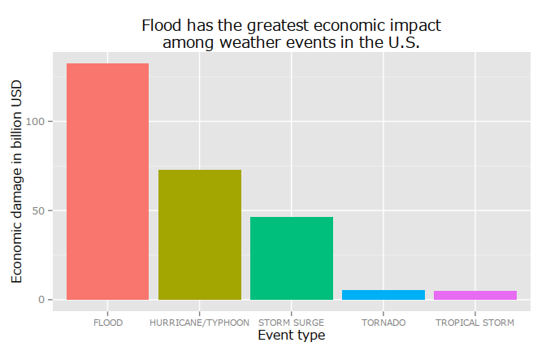
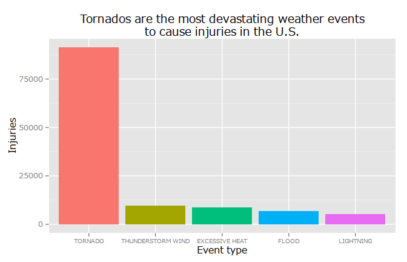
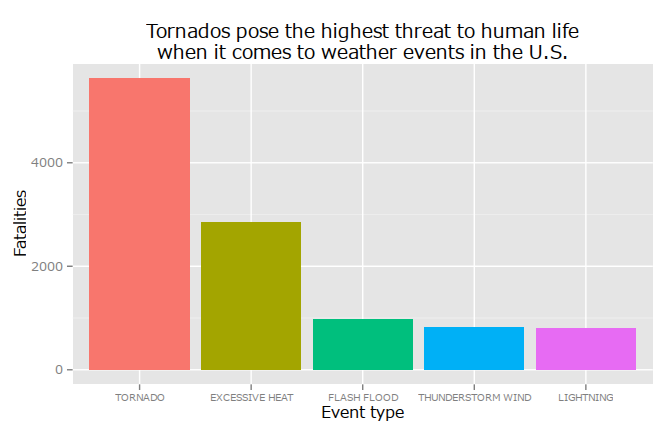

# Exploratory data analysis - Course Project 2
Balint SZEBENYI  
2015-05-22  

#A glimpse into the effects of severe weather events in the United States

The purpose of this paper is to investigate the effects of different types of weather events in the United States from a perspective of population health and economic consequences.
The analysis is based on data from the National Weather Service that encompasses the period between 1950 and 2011.
It is found that the economic and health related externalities of weather events can be assigned to different weather events. While flood causes the most damage to property it is the tornadoes that cause worries when it comes to threatening human life.

##Data Processing

###R Setup

####Libraries

```r
library(knitr) #markdown
library(stringr) #string_match
library(ggplot2) #ggplot2
library(scales) #ggplot2 scientific notation disabling
library(dplyr) #data manipulation
```

```
## 
## Attaching package: 'dplyr'
## 
## The following object is masked from 'package:stats':
## 
##     filter
## 
## The following objects are masked from 'package:base':
## 
##     intersect, setdiff, setequal, union
```

```r
library(xtable) #table output
```

####Setup working directory and figures location

```r
working_dir <- "/home/szebenyib/repr/course_project_02/"
opts_chunk$set(fig.path="figure/")
```

####Localization of units

```r
Sys.setlocale("LC_TIME", "C")
```

```
## [1] "C"
```


###Data retrieval and loading
The data was obtained from the web adress specified in the exercise. It is downloaded from there, so it is not the newest available data.

```r
filename <- "StormData.csv.bz2"
full_path <- paste(working_dir,
                   filename,
                   sep = "")
if (!file.exists(full_path)) {
  download.file(url = "https://d396qusza40orc.cloudfront.net/repdata%2Fdata%2FStormData.csv.bz2",
                destfile = full_path, 
                method = "curl")
}
df <- read.csv(file = bzfile(paste(working_dir,
                                  "StormData.csv.bz2",
                                  sep="")),
              stringsAsFactors = FALSE)
df <- tbl_df(df)
```

###One-dimensional variable analysis and data clean-up

Since there was no codebook to the dataset I had to rely on my instincts besides the supplied "StormDataPrep.doc". The document has helped a lot but it left room for guessing, which is a condition most unfortunate when it comes to analysing data.

The first variable to analyze is the **event type**.

```r
event_types <- table(df$EVTYPE)
head(event_types[order(-event_types)])
```

```
## 
##              HAIL         TSTM WIND THUNDERSTORM WIND           TORNADO 
##            288661            219940             82563             60652 
##       FLASH FLOOD             FLOOD 
##             54277             25326
```

```r
tail(event_types[order(-event_types)])
```

```
## 
##              WIND STORM  WINTER STORM/HIGH WIND WINTER STORM HIGH WINDS 
##                       1                       1                       1 
## WINTER STORM/HIGH WINDS              Wintry Mix                     WND 
##                       1                       1                       1
```
As it can be seen the event type variable is unfortunately not coherent. There are a lot of events which are named poorly. Take for example the wind storm, wnd, winter storm/high winds observations. They could be categorized in a main group 'storm'. In a real world scenario it would be wise to group the event types into a sane number of event types so that an analysis can answer event type related questions.
Since it would take an enormous time to tidy up all these observations manually I have decided to simplify this problem and concentrate on such events that are present in large numbers.

```r
data <- data.frame(event_types)
names(data) <- c("event_type", "count")
#Observations with more than a hundred counts:
sum(data$count > 100)
```

```
## [1] 69
```

```r
#This covers from all the cases:
sum(data$count[data$count > 100]) / sum(data$count)
```

```
## [1] 0.9948
```
Based on the above numbers I have decided that this distortion is acceptable in the current situation, noting that averages and conclusions of this analysis might be biased by this.
I have decided to examine the eventy types in the cases where there were more than a hundred occurences. I have renamed the similare event types to group them together so as to form logical groups.

```r
#data[data$count>100, ]
df$EVTYPE[df$EVTYPE == "COASTAL FLOODING"] <- "FLOOD"
df$EVTYPE[df$EVTYPE == "COLD/WIND CHILL"] <- "EXTREME COLD"
df$EVTYPE[df$EVTYPE == "DENSE FOG"] <- "FOG"
df$EVTYPE[df$EVTYPE == "EXTREME COLD/WINDCHILL"] <- "EXTREME COLD"
df$EVTYPE[df$EVTYPE == "EXTREME WINDCHILL"] <- "EXTREME COLD"
df$EVTYPE[df$EVTYPE == "FLASH FLOODING"] <- "FLOOD"
df$EVTYPE[df$EVTYPE == "FLOOD/FLASH FLOODING"] <- "FLOOD"
df$EVTYPE[df$EVTYPE == "FLOOD/FLASH FLOOD"] <- "FLOOD"
df$EVTYPE[df$EVTYPE == "FLOODING"] <- "FLOOD"
df$EVTYPE[df$EVTYPE == "FROST/FREEZE"] <- "EXTREME COLD"
df$EVTYPE[df$EVTYPE == "HEAVY SNOW"] <- "SNOW"
df$EVTYPE[df$EVTYPE == "HEAT"] <- "EXCESSIVE HEAT"
df$EVTYPE[df$EVTYPE == "HEAVY SURF/HIGH SURF"] <- "HIGH SURF"
df$EVTYPE[df$EVTYPE == "HIGH WINDS"] <- "HIGH WIND"
df$EVTYPE[df$EVTYPE == "HEAVY SNOW"] <- "SNOW"
df$EVTYPE[df$EVTYPE == "MARINE HIGH WIND"] <- "THUNDERSTORM WIND"
df$EVTYPE[df$EVTYPE == "MARINE TSTM WIND"] <- "THUNDERSTORM WIND"
df$EVTYPE[df$EVTYPE == "MODERATE SNOWFALL"] <- "SNOW"
df$EVTYPE[df$EVTYPE == "RECORD WARMTH"] <- "EXCESSIVE HEAT"
df$EVTYPE[df$EVTYPE == "RIP CURRENTS"] <- "RIP CURRENT"
df$EVTYPE[df$EVTYPE == "RIVER FLOOD"] <- "FLOOD"
df$EVTYPE[df$EVTYPE == "STORM SURGE/TIDE"] <- "STORM SURGE"
df$EVTYPE[df$EVTYPE == "STRONG WIND"] <- "THUNDERSTORM WIND"
df$EVTYPE[df$EVTYPE == "STRONG WINDS"] <- "THUNDERSTORM WIND"
df$EVTYPE[df$EVTYPE == "THUNDERSTORM WINDS"] <- "THUNDERSTORM WIND"
df$EVTYPE[df$EVTYPE == "TSTM WIND"] <- "THUNDERSTORM WIND"
df$EVTYPE[df$EVTYPE == "TSTM WIND/HAIL"] <- "THUNDERSTORM WIND"
df$EVTYPE[df$EVTYPE == "UNSEASONABLY WARM"] <- "EXCESSIVE HEAT"
df$EVTYPE[df$EVTYPE == "URBAN FLOOD"] <- "FLOOD"
df$EVTYPE[df$EVTYPE == "URBAN/SML STREAM FLD"] <- "FLOOD"
df$EVTYPE[df$EVTYPE == "WATERSPOUT"] <- "TORNADO"
df$EVTYPE[df$EVTYPE == "WILD/FOREST FIRE"] <- "WILDFIRE"
df$EVTYPE[df$EVTYPE == "WINTER WEATHER/MIX"] <- "WINTER WEATHER"
df$EVTYPE[df$EVTYPE == "WINTER STORM"] <- "WINTER WEATHER"
df$EVTYPE[df$EVTYPE == "HURRICANE"] <- "HURRICANE/TYPHOON"
df$EVTYPE[df$EVTYPE == "TYPHOON"] <- "HURRICANE/TYPHOON"
```

The F variable contains **typhoon categories**. Page 53 of the 10-16005 document gives an explanation of the typhoon categories and related wind speeds.

The MAG variable containts information about **earthquakes**. If measured on the Richter scale then the maximum should be around 10. This suggests that anything that is higher than 1000 (storing 10 as 1000) should be exempt from the analysis as a potentital sign of erroneous data. See: [http://www.geo.mtu.edu/UPSeis/magnitude.html]

```r
#boxplot(df$MAG)
df <- df[df$MAG < 1000, ]
```

Observing the **fatalities** the event with maximum fatalities happened on 7/12/1995, and it was caused by an intense heat wave in Illinois. It has caused fatalities that have resulted in as much as ``583`` victims.

Looking at the summary of **injuries** a heavily skewed distribution is visible, meaning that there were only few weather events causing injuries in vast numbers. Since the median is smaller then the mean, the distibution is heavily skewed to the left with a long right tail.

```r
summary(df$INJURIES)
```

```
##    Min. 1st Qu.  Median    Mean 3rd Qu.    Max. 
##     0.0     0.0     0.0     0.2     0.0  1700.0
```
The tornado was the typical event in case more than 1000 people were injured.

```r
table(df$EVTYPE[df$INJURIES > 1000])
```

```
## 
## ICE STORM   TORNADO 
##         1         4
```

**Property damage** is stored in two variables so the actual and 'machinereadable' value has to be constructed. Since the values do not correspond to the SI prefixes, only the instinction is left to guide the analysis.
First, the prefixes have to be converted to factors, then a brief summary is presented about them.

```r
df$PROPDMGEXP <- factor(df$PROPDMGEXP)
table(df$PROPDMGEXP)
```

```
## 
##             -      ?      +      0      1      2      3      4      5 
## 465926      1      8      5    216     25     13      4      4     28 
##      6      7      8      B      h      H      K      m      M 
##      4      5      1     40      1      6 424665      7  11328
```
It can be seen that there are many empty values for cases where property damage is absent. The more relevant values are H, K, M and B for hundred, kilo, million and billion. I have decided to consider the numbers refer to the exponents of then which I have assumed. I have considered the minus sign to symbolize the fact that the number does not need exponents as it the scale information is contained in the variable itself. If the scale variable is not present then the record is discarded as an invalid observation. The same function will be used for other variables as well.

```r
get_value_from_scaling <- function(value, scale) {
  ifelse(scale == "0" | scale == "-", value, value)
  ifelse(scale == "1", value * 1e1, value)
  ifelse(scale == "2" | scale == "H" | scale == "h", value * 1e2, value)
  ifelse(scale == "3" | scale == "K" | scale == "k", value * 1e3, value)
  ifelse(scale == "4", value * 1e4, value)
  ifelse(scale == "5", value * 1e5, value)
  ifelse(scale == "6" | scale == "M" | scale == "m", value * 1e6, value)
  ifelse(scale == "7", value * 1e7, value)
  ifelse(scale == "8", value * 1e8, value)
  ifelse(scale == "9" | scale == "B" | scale == "b", value * 1e9, value)
}
```


```r
df$property_damage <- get_value_from_scaling(value = df$PROPDMG,
                                             scale = df$PROPDMGEXP)
```

The **property damage** reveals a distribution that is skewed to the left.

```r
summary(df$property_damage)
```

```
##     Min.  1st Qu.   Median     Mean  3rd Qu.     Max. 
## 0.00e+00 0.00e+00 0.00e+00 3.06e+05 0.00e+00 1.15e+11
```

The same correction is applied on **crop damage** as it needs to be taken into consideration as economic damage.

```r
df$CROPDMGEXP <- factor(df$CROPDMGEXP)
df$crop_damage <- get_value_from_scaling(value = df$CROPDMG,
                                         scale = df$CROPDMGEXP)
```

Again, a right tail is to be observed.

```r
summary(df$crop_damage)
```

```
##     Min.  1st Qu.   Median     Mean  3rd Qu.     Max. 
## 0.00e+00 0.00e+00 0.00e+00 1.51e+04 0.00e+00 5.00e+09
```

##Results

###Economic impact

I have considered both the property and the crop damage to be an answer together for the economic impact of weather events.

```r
df$economic_damage <- df$property_damage + df$crop_damage
```

The top 5 events from a perspective of economic damage are visible below.

```r
#Calculating
df$economic_damage <- df$property_damage + df$crop_damage
economic_damage_per_evtype <- tapply(X = df$economic_damage,
                                     INDEX = df$EVTYPE,
                                     FUN = sum)
economic_damage_per_evtype <- sort(economic_damage_per_evtype,
                                   decreasing = TRUE)
data <- data.frame(economic_damage_per_evtype[1:5])
data$evtype <- factor(rownames(data), levels = rownames(data))
#Printing
a <- ggplot(data = data,
            aes(x = evtype,
                y = economic_damage_per_evtype.1.5. / 1e9,
                fill = evtype))
a + geom_bar(stat = "identity") + 
  ylab("Economic damage in billion USD") + 
  xlab("Event type") + 
  ggtitle("Flood has the greatest economic impact\namong weather events in the U.S.") + 
  guides(fill = FALSE) + 
  theme(axis.text.x = element_text(size = 8))
```

 

It can be extracted from the graph that flood is responsible for most of the damage to the economy regarding weather events. About half as harmful are hurricanes and typhons. Although flood has deemed to cause the most damage, the four other events all have a high windspeed in common and together they overtake flood in the ranking.

###Effect on publich health

The top 5 events that were most harmful to population health are visible below

```r
#Calculating
injuries_per_evtype <- tapply(X = df$INJURIES,
                              INDEX = df$EVTYPE,
                              FUN = sum)
injuries_per_evtype <- sort(injuries_per_evtype,
                            decreasing = TRUE)
data <- data.frame(injuries_per_evtype[1:5])
data$evtype <- factor(rownames(data), levels = rownames(data))
#Printing
a <- ggplot(data = data,
            aes(x = evtype,
                y = injuries_per_evtype.1.5.,
                fill = evtype))
a + geom_bar(stat = "identity") + 
  ylab("Injuries") + 
  xlab("Event type") + 
  ggtitle("Tornados are the most devastating weather events\nto cause injuries in the U.S.") + 
  guides(fill = FALSE) +
  theme(axis.text.x = element_text(size = 7.5))
```

 

Tornados cause the most injuries, no doubt. They cause more injuries than the other four events together. It is interesting to observe that lightning alone has caused many injuries for it is a phenomenon that can see it's effects avoided by using the invention of Benjamin Franklin.


```r
#Calculating
fatalities_per_evtype <- tapply(X = df$FATALITIES,
                              INDEX = df$EVTYPE,
                              FUN = sum)
fatalities_per_evtype <- sort(fatalities_per_evtype,
                              decreasing = TRUE)
data <- data.frame(fatalities_per_evtype[1:5])
data$evtype <- factor(rownames(data), levels = rownames(data))
#Printing
a <- ggplot(data = data,
            aes(x = evtype,
                y = fatalities_per_evtype.1.5.,
                fill = evtype))
a + geom_bar(stat = "identity") + 
  ylab("Fatalities") + 
  xlab("Event type") + 
  ggtitle("Tornados pose the highest threat to human life\nwhen it comes to weather events in the U.S.") + 
  guides(fill = FALSE) +
  theme(axis.text.x = element_text(size = 7.5))
```

 

Fatalities show the observer a different ranking. While tornados are still on the lead, excessive heat appears on the second place. The effects of heat seem diminishing besides tornados but when heat exercises its power it tends to take human lives and cause a lot of injuries.

##Summary

To summarize the findings concisely, one could say that high winds cause more injuries and they are more lethal by their nature. On the other hand flood is more harmful when severe weather events are analyzed from an economic point of view. This is however only a very brief analysis - although it took a look of time - and as such it should be treated only with caution.
